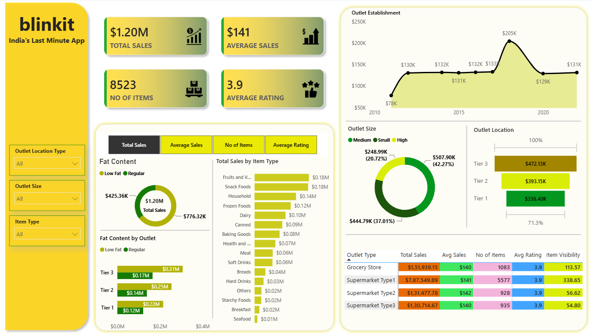

# 🛒 Blinkit Sales Dashboard | Power BI

---

## 📌 Project Overview

This project is an interactive **Power BI Dashboard** built using Blinkit sales data.

The dashboard helps analyze sales performance, outlet distribution, customer ratings, and product categories through interactive visualizations.

---

## 📊 Dashboard Preview

---

## 📈 Business KPIs

| KPI | Value |
|------|-------|
| 💰 Total Sales | **$1.20M** |
| 🛒 Number of Items | **8523** |
| ⭐ Average Rating | **3.9** |
| 📊 Average Sales | **$141** |

---

## 📌 Dashboard Features

- 📈 Sales Trend Analysis
- 🏪 Outlet Performance Analysis
- 🍎 Item Type Analysis
- 🥛 Fat Content Analysis
- 📍 Outlet Location Insights
- 📦 Outlet Size Distribution
- 🎯 Interactive Filters
- 📊 KPI Cards

---

## 🛠️ Tools & Technologies

- Microsoft Power BI
- Power Query
- DAX
- Data Modeling
- Data Visualization

---

## 💡 Business Insights

- High-sized outlets generated the highest revenue.
- Tier 3 outlets contributed the largest share of sales.
- Fruits & Vegetables and Snack Foods were among the top-selling item categories.
- Customer ratings remained consistent across outlet types.

---

## 📂 Project Files

- BLINKIT POWER BI DASHBOARD.pbix
- Dashboard Screenshot

---

## 👨‍💻 Author

**Balaji G S**

MCA Student | Aspiring Data Analyst | Power BI Enthusiast

GitHub: https://github.com/YOUR_USERNAME

LinkedIn: https://linkedin.com/in/YOUR_LINKEDIN

---

⭐ If you like this project, consider giving it a Star.
